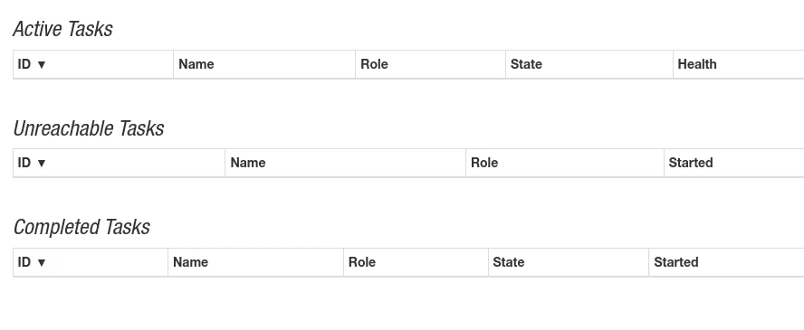
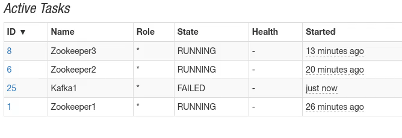

# go-mesos-framework-kafka

Dies ist ein Kafka Framework für Apache Mesos

## Vorraussetzung

Dieses Framework ist aktuell so erstellt, dass es MESOS mit SSL Verschlüsselung und Authentication benötigt.

## Framework starten

```Bash

export FRAMEWORK_USER="root"
export FRAMEWORK_NAME="kafkaframework"
export MESOS_PRINCIPAL="<mesos_principal>"
export MESOS_USERNAME="<mesos_user>"
export MESOS_PASSWORD="<mesos_password>"
export MESOS_MASTER="<mesos_master_server>:5050"
export LOGLEVEL="DEBUG"
export DOMAIN="weave.local"
export ZOOKEEPER_COUNT=1
export KAFKA_COUNT=3
export RES_CPU=0.1
export RES_MEM=3200

go run init.go app.go
```

Dies startet das Framework. Es wird sich an den Mesos Master anmelden. Nach wenigen Sekunden kann man "kafkaframework" als Eintrag in der Mesos UI sehen. Sobald das Framework erfolgreich gestartet wurde, startet es Zookeeper. Ist Zookeeper erfolgreich gestartet, werden die Kafka Container gestartet.



Faellt ein Container aus, wird dieser neugestartet. 



## Task Status Abfragen

Um den Status eines Tasks über das Framework abzufragen, folgendes Kommando verwenden:

```Bash
curl -X GET 127.0.0.1:10000/v0/container/<taskId> -d 'JSON'  | jq
```

